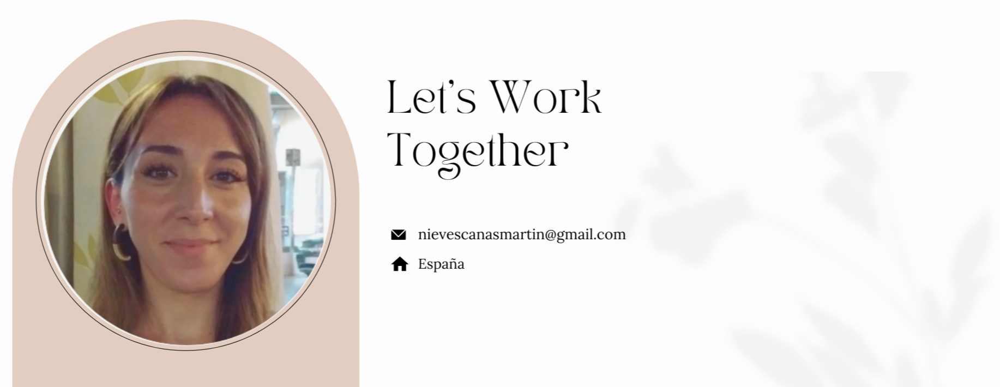

# Hello, my name is Nieves Canas

## Sobre mí
- 🌱 Actualmente aprendiendo **React Native** y **Machine Learning**.
- 💻 Experiencia en **JavaScript, Python, HTML/CSS, Node.js**.
- 🤝 Abierta a colaborar en proyectos open-source.
- 🎯 Mi objetivo es seguir mejorando como desarrolladora full-stack.

## 🔧 Tecnologías y Herramientas

## 🚀 Proyectos destacados
- [Weather App](https://github.com/nievescanas/weather-app) - Una aplicación web que muestra el clima en tiempo real usando la API de OpenWeather.
- [Task Manager](https://github.com/nievescanas/task-manager) - Aplicación para gestionar tareas, con autenticación y sincronización en tiempo real.
- [Portfolio Personal](https://github.com/nievescanas/portfolio) - Mi portafolio personal donde muestro mis proyectos y experiencia.

## 📊 Mis estadísticas en GitHub

## 🎯 Gráfico de actividad

## 🏆 Logros en GitHub

## 📫 Cómo contactarme

- [LinkedIn](https://linkedin.com/in/nieves-canas-martín)
- [Correo electrónico](mailto:nievescanas@ejemplo.com)

